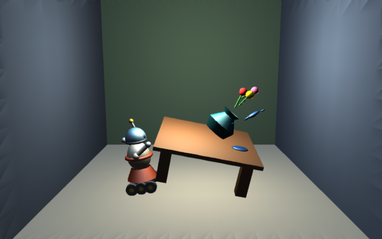

# GMAN — a RenderMan-compatible renderer

[](https://github.com/jac18281828/gman/actions/workflows/ci.yml)

GMAN is a 1999 RenderMan renderer revived and rewritten to build
again in 2026. Point it at an `.rib` file and it renders an image. GMAN is
compact and easy to follow.  It is using C++17 and CMake but there are plenty of
C modules as well.



*GMAN is at it again!* — `samples/vase.rib`, rendered by `gman`. Quadrics and
polygons, three surface shaders, three lights, no textures and one sample
per pixel.

## The tree

```
include/     GMAN header files, including ri.h
libgman/     the core library: RIB parser, RI state machine, image writers
libgmanrib/  GMANASCII, the RIB writer backend over the abstract RI interface
renderers/   loadable rendering modules -- zbuffer, plus reyes, raytracer and
             radiosity, which are non-functional and build OFF by default
shaders/     loadable shading modules
gmansl/      grammar and driver for a shading language compiler that was never
             finished; kept as a record, built by nothing
gman/        the gman command line utility
samples/     demo scenes and their renders
tests/       the test suite and its RIB corpus
doc/         the 1999 design document
```

## Building

Requires CMake 3.21 or newer, a C++17 compiler,
libtiff, libpng and zlib. libjpeg is optional. POSIX only -- macOS and Linux.

```sh
cmake --preset dev
cmake --build build --parallel
ctest --test-dir build --output-on-failure
```

Binary releases ship for Linux x86_64, Linux arm64, and macOS arm64;
Intel Macs can build from source with the commands above.

`AGENTS.md`'s Tests section covers the test layout, adding a new test, and
golden-image regeneration; its Gates section is the full gate list CI runs.

To install into a prefix:

```sh
cmake --install build --prefix /usr/local
```

## Development container

A devcontainer carrying the same toolchain CI uses -- both gcc and clang, the
sanitizers, valgrind, yamlfmt and commitlint -- lives in .devcontainer/. Open
the repo in VS Code and choose "Reopen in Container", or run every gate at
once with:

```sh
./build.sh
```

## What works

The front end. RIB parsing covers a subset of the RISpec 3.2 request set
plus the de-facto conventions real exporters rely on: array and
inline-declared parameters (both bracketed and unbracketed forms),
facevarying parameters, gzip'd RIB (`.rib.gz` or any file gzip'd regardless
of name), ReadArchive with cycle detection, and graceful recovery from any
request GMAN does not recognize -- warn once, skip it, keep parsing. See
AGENTS.md's "RIB authoring" section, "What the RIB front end actually
supports," for how to find exactly which requests render, which parse and
are ignored, and which are unrecognized straight from the source.

The back end renders a real picture: object -> world -> camera -> screen ->
NDC -> raster, analytic normals on every quadric, backface culling against
the true per-face view vector,
`ambientlight`/`distantlight`/`pointlight`/`spotlight`, and
`matte`/`plastic`/`metal` C++ surface shaders against a real
`GMANSurfaceEnv` -- Gouraud-shaded, lit, perspective-correct. See AGENTS.md's
"RIB authoring" section, "Shader plugin authoring," for the shader-plugin
contract. Also working: the RI state machine, transform and matrix math,
Perlin noise, the spline and shading-language support functions now
reachable from a shader, and the TIFF, PNG, JPEG and PNM image writers.

At the default `Clipping`, flat or narrow-z-range geometry (a camera-facing
`Disk`, a partial `Sphere`) can render corrupted or blank from a near-clip
precision defect -- pair such geometry with an explicit `Clipping <near>
<far>`. See AGENTS.md's "RIB authoring" section, "Explicit `Clipping` where
geometry is flat or narrow in z."

`tests/baseline_test.cpp` and `tests/lighting_test.cpp` record what actually
renders and how it is verified.

### Against the standard

What the RenderMan standard asks of a renderer, and where GMAN stands on
each:

- **[ ] High-end geometry.** NURBS, trim curves and subdivision surfaces
  parse and are ignored. `Patch` and `PatchMesh` both rasterize, `"bilinear"`
  and `"bicubic"`; `NuPatch` still does not.
- **[~] Antialiasing and motion blur.** `PixelSamples` and `PixelFilter` are
  wired end to end: the z-buffer renderer rasterizes into a per-sample
  buffer (default 2x2) and resolves it through one of five filter kernels
  (default Gaussian). Motion blur is still absent -- `Shutter` and
  `DepthOfField` are read and unused, and want REYES's stochastic
  sampling in time and across the lens.
- **[~] Programmable shading.** Pluggable, not programmable. Surface and
  light shaders are C++ modules loaded at run time -- the right shape behind
  the wrong front end. Volume shaders parse and do nothing.
- **[ ] Displacement shading.** Wants micropolygons, which want REYES.
- **[ ] Many large textures, flat memory.** No texturing. Surface points
  already carry their `s,t`, so the input side is ready and the lookup is
  not written.
- **[~] Quantization, filtering, reconstruction.** Exposure and gamma are
  honored, and pixel reconstruction now runs (see Antialiasing above).
  Quantization still warns and passes the colour through untouched.
- **[ ] Shading time against shading quality.** `ShadingRate` and the detail
  controls are read from the RIB and never consulted.

None finished, three begun. The standard is worth keeping as the target: a
renderer is easy to begin and hard to finish, and the usual way it fails is
that nobody settles what finished means.

## Files

```
COPYING      GNU Lesser General Public License, version 2.1
AGENTS.md    build commands, gate list and house conventions
NEWS         release notes
TODO         what was outstanding when the project was shelved
AUTHORS      contributors
```
