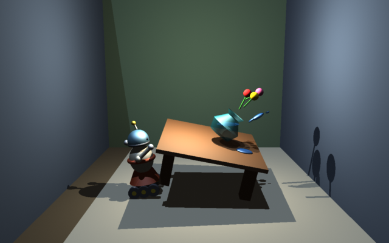
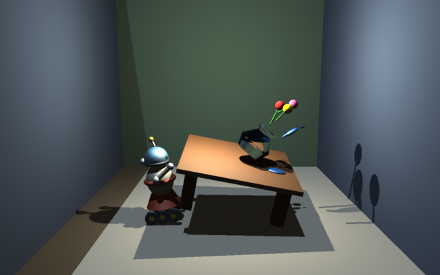
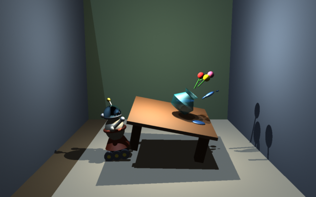
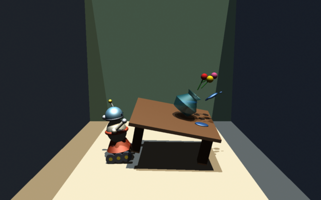
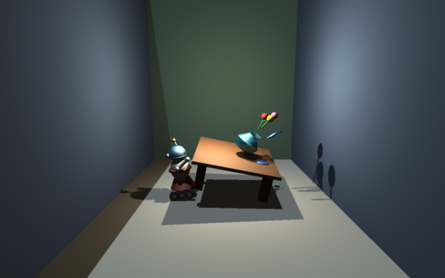
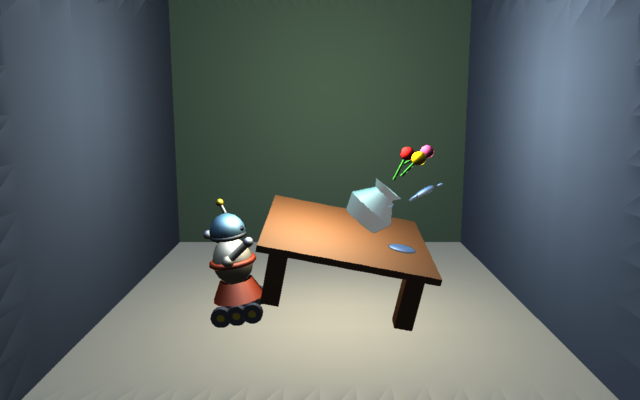
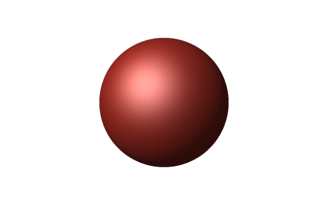

# GMAN — Realistic RenderMan Renderer

[](https://github.com/jac18281828/gman/actions/workflows/ci.yml)

Begun in 1999, revived in 2026. [gman-toolkit.sourceforge.net](https://gman-toolkit.sourceforge.net)

[](https://gman-toolkit.sourceforge.net)

## Try it

```sh
curl -sL https://github.com/jac18281828/gman/releases/download/0.9.1/gman-0.9.1-linux-x86_64.tar.gz | tar xz
curl -sLO https://raw.githubusercontent.com/jac18281828/gman/0.9.1/samples/vase.rib
export PATH="$PWD/gman-0.9.1-linux-x86_64/bin:$PATH"
gman -r gmanraytracer vase.rib
```

That writes `vase.png`, the picture above, in a few seconds. It needs libtiff, libpng, libjpeg
and zlib installed. Linux arm64 and macOS arm64 builds are on the
[releases page](https://github.com/jac18281828/gman/releases).

## Poke it

Change one line of `vase.rib` and render it again with `gman -r gmanraytracer vase.rib`. Each
picture starts from the original scene.

| | |
|---|---|
| <br>**Glass vase.** In the `## Vase` block, make the surface `Surface "glass"` and delete the `Opacity`. | <br>**Mirror dome.** Under `# head dome`, make the surface `Surface "mirror" "Kr" [1]`. |
| <br>**Sunlight.** Swap the lamp for the sun: `LightSource "distantlight" 2 "intensity" [1.2] "lightcolor" [1 0.95 0.83] "from" [1 3 10] "to" [0 0 1]`. The walls now shadow the room. | <br>**Wider lens.** `Projection "perspective" "fov" [55]`. |
| <br>**One sample a pixel.** `PixelSamples 1 1`, and the edges go jagged. | <br>**The z-buffer.** No edit: plain `gman vase.rib` renders the fast preview, without shadows, reflection or refraction. |

### A first scene

Eleven lines, from nothing:

```
Display "first.png" "file" "rgba"
Format 640 400 1
Projection "perspective" "fov" [30]
Translate 0 0 6
WorldBegin
LightSource "ambientlight" 1 "intensity" [0.2]
LightSource "distantlight" 2 "from" [-2 2 -3] "to" [0 0 0]
Surface "plastic"
Color [0.9 0.25 0.2]
Sphere 1 -1 1 360
WorldEnd
```

```sh
gman -r gmanraytracer first.rib
```



## What GMAN renders

- **Geometry.** `Polygon`, `GeneralPolygon`, `PointsPolygons`, `PointsGeneralPolygons` and the seven
  quadrics, `Sphere`, `Cone`, `Cylinder`, `Hyperboloid`, `Paraboloid`, `Disk` and `Torus`, under
  both renderers. `Patch` and `PatchMesh`, bilinear and bicubic, and `NuPatch` under the z-buffer.
- **Surface shaders.** `matte`, `plastic`, `paintedplastic`, `metal` and `shinymetal` under both
  renderers; `glass` and `mirror` trace rays, so they need the ray tracer.
- **Light shaders.** `ambientlight`, `distantlight`, `pointlight` and `spotlight`.
- **Two renderers.** `gmanzbuffer`, the default preview, and `gmanraytracer`, with shadows,
  reflection, refraction and transparency.
- **Antialiasing.** `PixelSamples` supersamples; `PixelFilter` reconstructs through box, triangle,
  Gaussian, Catmull-Rom or sinc.
- **Textures.** `texture()` and `environment()` read maps written by `MakeTexture` and
  `MakeLatLongEnvironment`.
- **RIB.** Plain or gzip'd, with `ReadArchive`. An unrecognized request warns once and is skipped.
- **Image drivers.** TIFF, PNM, PNG and JPEG; `gman --version` lists the ones built in.

## Render

`gman scene.rib` renders a RIB file through the default z-buffer renderer,
`gmanzbuffer`. `-r gmanraytracer` renders the same file through the ray
tracer instead, with real reflection, refraction and shadows. Output lands
wherever the scene's own `Display` request names, relative to the current
directory; `gman` takes no output flag of its own.

`-d`, `-i`, `-w`, `-e` and `-q` set the log level to debug, info (the
default), warning, error or disaster-only; `-l` also writes a log file named
for the RIB; `-h` prints usage; `--version` prints the version and the
drivers built in.

At the default `Clipping`, flat or narrow-z-range geometry renders
corrupted or blank; pair it with an explicit `Clipping <near> <far>`.

## Build from source

Requires CMake 3.21 or newer, a C++20 compiler with `<format>` (GCC 13 or
Clang 17 or newer), libtiff and zlib. libpng and libjpeg are optional: a
build without one rejects that `Display` extension with `RIE_BADFILE`, and
`gman --version` lists the drivers compiled in. POSIX only: macOS and
Linux.

On Linux, install the libraries first:

```sh
sudo apt-get install cmake libtiff-dev libpng-dev libjpeg-dev zlib1g-dev
```

```sh
cmake --preset dev
cmake --build build --parallel
ctest --test-dir build --output-on-failure
```

`AGENTS.md`'s Tests section covers the test layout, adding a new test and
golden-image regeneration; its Completion Gates section lists the local
gates, and says CI covers the rest.

`samples/vase.rib`'s `Display` writes PNG, which needs libpng at build
time: without it, `gman samples/vase.rib` rejects the scene with
`RIE_BADFILE`; install libpng and reconfigure with `-DGMAN_WITH_PNG=ON` to
fix it.

To install into a prefix:

```sh
cmake --install build --prefix /usr/local
```

The installed prefix carries `bin/gman` and a CMake package. A program
links gman with `find_package(gman CONFIG REQUIRED)` and
`target_link_libraries(app PRIVATE gman::gman_core)`, and includes
`<gman/ri.h>`. Link libgman from C, below, walks through a full example.

### Development container

A devcontainer lives in `.devcontainer/`, carrying the same toolchain CI
uses: both gcc and clang, the sanitizers, valgrind, yamlfmt and commitlint.
Open the repo in VS Code and choose "Reopen in Container".

## Write a shader

A surface shader is a `GMANSurfaceShader` subclass, built as a loadable
module. Each `Surface` call builds its own instance, whose constructor
resolves its parameters from the plugin's `GMANParameterList`, so
`computeCi` and `computeOi` are `const`, read the `GMANSurfaceEnv` they are
given, and return a `GMANColor` by value. `shaders/gmanmatte.cpp` is the
model: it exports itself through three `extern "C"` entry points:

```cpp
extern "C" GMAN_EXPORT GMANLoadableObjectInfo* GMANGetLoadableInfo(void) { return &loadableInfo; }

extern "C" GMAN_EXPORT GMANShader* GMANLoadShader(GMANParameterList const& parameters) {
  return new gmanshader::matte(parameters);
}

extern "C" GMAN_EXPORT void GMANDestroyShader(GMANShader* shader) { delete shader; }
```

Build it in-tree with `gman_add_plugin` in the root `CMakeLists.txt`:

```cmake
gman_add_plugin(gman_myshader shaders/gmanmyshader.cpp)
set_target_properties(gman_myshader PROPERTIES OUTPUT_NAME "myshader")
```

`Surface "myshader"` then loads `libmyshader.so`, the name `OUTPUT_NAME`
gives it. The installed package exports no `gman_add_plugin`: a new shader
builds only inside a gman checkout.

## Link libgman from C

A C program calls the same RenderMan interface through `<gman/ri.h>`. This
one renders a lit sphere:

```c
#include <gman/ri.h>

int main(void) {
  RiBegin(RI_NULL);
  RiDisplay("sphere.tif", RI_FILE, RI_RGBA, RI_NULL);
  RiTranslate(0, 0, 5);

  RiWorldBegin();
  RiLightSource("ambientlight", RI_NULL);
  RiSphere(1, -1, 1, 360, RI_NULL);
  RiWorldEnd();

  RiEnd();
  return 0;
}
```

```cmake
cmake_minimum_required(VERSION 3.21)
project(sphere LANGUAGES C)

find_package(gman CONFIG REQUIRED)

add_executable(sphere sphere.c)
target_link_libraries(sphere PRIVATE gman::gman_core)
```

Configure against the installed prefix, build and run:

```sh
cmake -S . -B build -DCMAKE_PREFIX_PATH=/usr/local
cmake --build build
./build/sphere
```

This writes `sphere.tif` in the current directory.

## The GMAN project

```
include/     GMAN header files, including ri.h
libgman/     the core library: RIB parser, RI state machine, image writers
libgmanrib/  the RIB-writer plugin RiBegin("x.rib") loads, not yet trustworthy
renderers/   loadable rendering modules -- zbuffer and raytracer, plus reyes and
             radiosity, which are non-functional and build OFF by default
shaders/     loadable shading modules
gmansl/      grammar and driver for a shading language compiler that was never
             finished; kept as a record, built by nothing
gman/        the gman command line utility
samples/     demo scenes and their renders
tests/       the test suite and its RIB corpus
doc/         the 1999 design document
```

`tests/rib/` holds 81 more scenes, the test suite's own.

## Contributing

Bug reports, fixes and scenes that render wrong are all welcome. For a rendering bug the `.rib`
file is the reproduction: attach it and the image you got.
[CONTRIBUTING.md](CONTRIBUTING.md) covers pull requests, the three checks to run before you push,
Conventional Commits and the rebase-only history. `AGENTS.md` briefs an AI agent working in the
tree.
