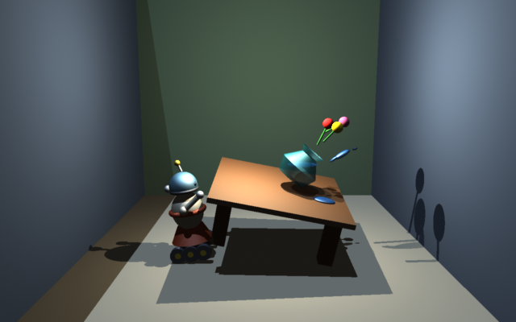
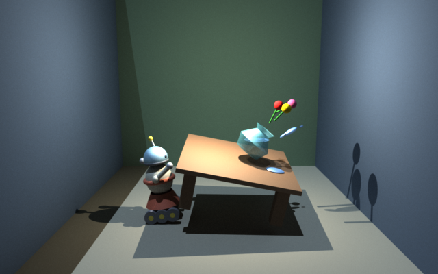
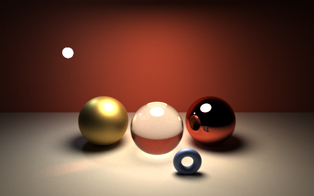
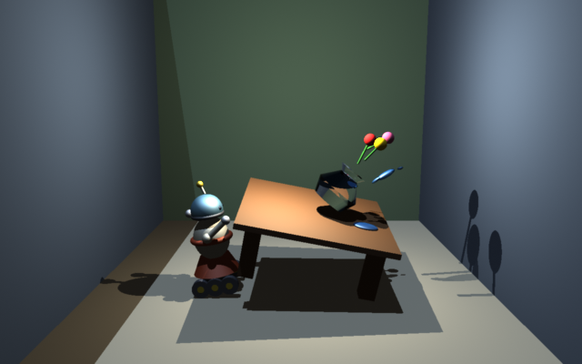
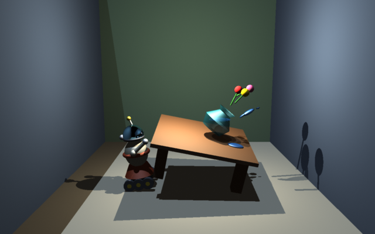
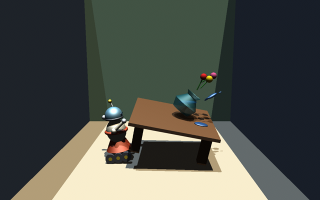
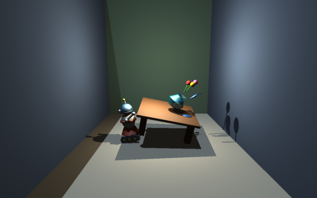
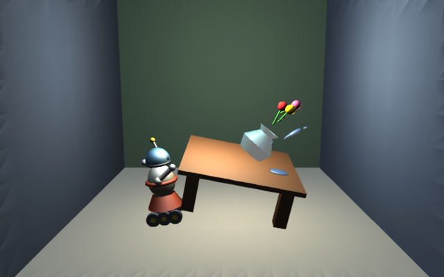
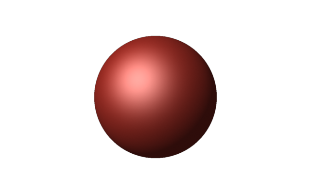

# GMAN — Realistic RenderMan Renderer

[](https://github.com/jac18281828/gman/actions/workflows/ci.yml)

Begun in [1999](https://gman-toolkit.sourceforge.net), revived in [2026](https://2ad.com/gman.html).

[](https://2ad.com/gman.html)

## Install

GMAN 1.0.0 ships as a tarball for Linux x86_64, Linux arm64 and macOS arm64 on the
[releases page](https://github.com/jac18281828/gman/releases). gman links libtiff, libpng, libjpeg
and zlib at run time. On Linux:

```sh
sudo apt-get install libtiff-dev libpng-dev libjpeg-dev zlib1g-dev
```

On macOS:

```sh
brew install libtiff libpng jpeg
```

Download the tarball for your platform, unpack it, `cd` into the folder and run the installer:

```sh
tar xzf gman-1.0.0-linux-x86_64.tar.gz
cd gman-1.0.0-linux-x86_64
sudo ./install.sh
```

`install.sh` installs `bin/`, `lib/` and `include/`, that is the `gman` program, its renderer and
shader plugins, libgman and its headers, into `/usr/local`, which needs `sudo`. It then runs the
installed `gman --version`, and on macOS clears the download quarantine from the files it wrote.

- `./install.sh --prefix "$HOME/.local"` installs into a directory of your own, with no `sudo`.
- `sudo ./install.sh --uninstall` removes exactly the files the install wrote, and each directory
  it created that is now empty. `--prefix` names the same directory in both commands. The list of
  files is `share/gman/install_manifest.txt` under the prefix, and installing over an earlier
  install removes that one first.
- `install.sh` leaves your `PATH` and shell profile alone. When the prefix's `bin` is not on
  `PATH`, it says so and you add it.
- `samples/` stays in the unpacked folder: `install.sh` does not install it, and the next section
  renders from it.

To build gman yourself and install it with CMake, see [Build from source](#build-from-source).

## Try it

From the unpacked folder:

```sh
gman -r gmanraytracer samples/vase.rib
```

That writes `vase.png` to the current directory, the picture at the top, in a few seconds.

## Path trace it

Add one line to `samples/vase.rib` in the unpacked folder, under `PixelSamples 2 2`, and render it
through the path tracer:

```
Option "pathtracer" "integer samples" [64]
```

```sh
gman -r gmanpathtracer samples/vase.rib
```

[](https://2ad.com/gman.html)

Sixty-four paths through each of the four subpixels follow the light as it bounces off the walls,
floor and table. The render takes about three minutes on one core of an Apple M3 Max, where the ray
tracer takes seconds. The path tracer computes the bounce light the scene's `ambientlight` stood in
for, so it skips that light and says so:

```
gmanpathtracer: ambientlight lights nothing under the path tracer; skipped 1 light(s).
```

## Light it with area lights

`samples/materials.rib` sets four materials before a clay wall and lights them with two area
lights, a warm disk overhead and a small blue sphere lamp at the left:

```sh
gman -r gmanpathtracer samples/materials.rib
```

[](https://2ad.com/gman.html)

From the left: gold `shinymetal`, `glass`, a `mirror` that takes the wall's clay colour, and a
`plastic` torus. The overhead disk pools a soft shadow under each one. The scene traces 64 paths a
subpixel, about two minutes on one core of an Apple M3 Max; the picture traces 256, set by
`Option "pathtracer" "integer samples"` at the top of the file.

## Poke it

Change one line of `samples/vase.rib` in the unpacked folder and render it again with
`gman -r gmanraytracer samples/vase.rib`. Each picture starts from the original scene.

| | |
|---|---|
| <br>**Glass vase.** In the `## Vase` block, make the surface `Surface "glass"` and delete the `Opacity`. | <br>**Mirror dome.** Under `# head dome`, make the surface `Surface "mirror" "Kr" [1]`. |
| <br>**Sunlight.** Swap the lamp for the sun: `LightSource "distantlight" 2 "intensity" [1.2] "lightcolor" [1 0.95 0.83] "from" [1 3 10] "to" [0 0 1]`. The walls now shadow the room. | <br>**Wider lens.** `Projection "perspective" "fov" [55]`. |
| <br>**One sample a pixel.** `PixelSamples 1 1`, and the edges go jagged. | <br>**The z-buffer.** No edit: plain `gman samples/vase.rib` renders the fast preview, without shadows, reflection or refraction. |

### A first scene

Eleven lines, from nothing:

```
Display "first.png" "file" "rgba"
Format 640 400 1
Projection "perspective" "fov" [30]
Translate 0 0 6
WorldBegin
LightSource "ambientlight" 1 "intensity" [0.2]
LightSource "distantlight" 2 "from" [-2 2 -3] "to" [0 0 0]
Surface "plastic"
Color [0.9 0.25 0.2]
Sphere 1 -1 1 360
WorldEnd
```

```sh
gman -r gmanraytracer first.rib
```



## What GMAN renders

- **Geometry.** `Polygon`, `GeneralPolygon`, `PointsPolygons`, `PointsGeneralPolygons` and the seven
  quadrics, `Sphere`, `Cone`, `Cylinder`, `Hyperboloid`, `Paraboloid`, `Disk` and `Torus`, under
  every renderer. `Patch` and `PatchMesh`, bilinear and bicubic, and `NuPatch` under the z-buffer.
- **Surface shaders.** `matte`, `plastic`, `paintedplastic`, `metal` and `shinymetal` under every
  renderer; `glass` and `mirror` trace rays, so they need the ray tracer or the path tracer.
- **Light shaders.** `ambientlight`, `distantlight`, `pointlight` and `spotlight`, and
  `AreaLightSource "arealight"`, which makes the `Sphere` or `Disk` after it glow under the path
  tracer.
- **Three renderers.** `gmanzbuffer`, the default preview; `gmanraytracer`, with shadows,
  reflection, refraction and transparency; and `gmanpathtracer`, which adds light bounced off every
  surface, soft shadows from area lights and glossy reflection.
- **Bounce light.** Under the ray tracer, `Option "render" "string indirect" ["radiosity"]` adds a
  radiosity pass: it solves the diffuse light bouncing between surfaces, colour bleeding included,
  and each surface picks it up through `ambient()`, weighted by its `Ka`.
  `Option "radiosity" "float elementsize"` sets the solver's patch size, an eighth of the scene by
  default. Set `Ka` equal to `Kd` and drop the `ambientlight`, which the pass replaces.
- **Antialiasing.** `PixelSamples` supersamples; `PixelFilter` reconstructs through box, triangle,
  Gaussian, Catmull-Rom or sinc.
- **Textures.** `texture()` and `environment()` read maps written by `MakeTexture` and
  `MakeLatLongEnvironment`.
- **RIB.** Plain or gzip'd, with `ReadArchive`. An unrecognized request warns once and is skipped.
- **Image drivers.** TIFF, PNM, PNG and JPEG; `gman --version` lists the ones built in.

## Render

`gman scene.rib` renders a RIB file through the default z-buffer renderer,
`gmanzbuffer`. `-r gmanraytracer` renders the same file through the ray
tracer instead, with real reflection, refraction and shadows, and
`-r gmanpathtracer` through the path tracer, which traces
`Option "pathtracer" "integer samples" [n]` paths per pixel. Output lands
wherever the scene's own `Display` request names, relative to the current
directory; `gman` takes no output flag of its own.

`-d`, `-i`, `-w`, `-e` and `-q` set the log level to debug, info (the
default), warning, error or disaster-only; `-l` also writes a log file named
for the RIB; `-h` prints usage; `--version` prints the version and the
drivers built in.

At the default `Clipping`, flat or narrow-z-range geometry renders
corrupted or blank; pair it with an explicit `Clipping <near> <far>`.

## Build from source

Requires CMake 3.21 or newer, a C++20 compiler with `<format>` (GCC 13 or
Clang 17 or newer), libtiff and zlib. libpng and libjpeg are optional: a
build without one rejects that `Display` extension with `RIE_BADFILE`, and
`gman --version` lists the drivers compiled in. POSIX only: macOS and
Linux.

On Linux, install the libraries first:

```sh
sudo apt-get install cmake libtiff-dev libpng-dev libjpeg-dev zlib1g-dev
```

```sh
cmake --preset dev
cmake --build build --parallel
ctest --test-dir build --output-on-failure
```

`AGENTS.md`'s Tests section covers the test layout, adding a new test and
golden-image regeneration; its Completion Gates section lists the local
gates, and says CI covers the rest.

`samples/vase.rib`'s `Display` writes PNG, which needs libpng at build
time: without it, `gman samples/vase.rib` rejects the scene with
`RIE_BADFILE`; install libpng and reconfigure with `-DGMAN_WITH_PNG=ON` to
fix it.

To install into a prefix:

```sh
cmake --install build --prefix /usr/local
```

The installed prefix carries `bin/gman` and a CMake package. A program
links gman with `find_package(gman CONFIG REQUIRED)` and
`target_link_libraries(app PRIVATE gman::gman_core)`, and includes
`<gman/ri.h>`. Link libgman from C, below, walks through a full example.

To remove what `cmake --install` wrote, delete the files CMake recorded:

```sh
xargs rm < build/install_manifest.txt
```

### Development container

A devcontainer lives in `.devcontainer/`, carrying the same toolchain CI
uses: both gcc and clang, the sanitizers, valgrind, yamlfmt and commitlint.
Open the repo in VS Code and choose "Reopen in Container".

## Write a shader

A surface shader is a `GMANSurfaceShader` subclass, built as a loadable
module. Each `Surface` call builds its own instance, whose constructor
resolves its parameters from the plugin's `GMANParameterList`, so
`computeCi` and `computeOi` are `const`, read the `GMANSurfaceEnv` they are
given, and return a `GMANColor` by value. A shader may also override
`bsdf(GMANSurfaceEnv const&) const` to return the `gman::BSDF` the path
tracer samples, defaulting to a Lambert lobe of `Cs`; a `bsdf` override
must not call the base `albedo`, since the two would recurse. A shader may
override `albedo(GMANSurfaceEnv const&) const` to report its diffuse
reflectance, defaulting to its BSDF's `rhoD()` clamped to [0, 1]. A
closure combines libgman's own lobes — `addLambert`, `addGGX`, `addMirror`
and `addDielectric` — and never defines a new one; `rhoD` reports the
Lambert lobes alone, so a glossy or delta lobe never shows in `albedo`.
`shaders/gmanmatte.cpp` is the model:
it exports itself through three `extern "C"` entry points:

```cpp
extern "C" GMAN_EXPORT GMANLoadableObjectInfo* GMANGetLoadableInfo(void) { return &loadableInfo; }

extern "C" GMAN_EXPORT GMANShader* GMANLoadShader(GMANParameterList const& parameters) {
  return new gmanshader::matte(parameters);
}

extern "C" GMAN_EXPORT void GMANDestroyShader(GMANShader* shader) { delete shader; }
```

Build it in-tree with `gman_add_plugin` in the root `CMakeLists.txt`:

```cmake
gman_add_plugin(gman_myshader shaders/gmanmyshader.cpp)
set_target_properties(gman_myshader PROPERTIES OUTPUT_NAME "myshader")
```

`Surface "myshader"` then loads `libmyshader.so`, the name `OUTPUT_NAME`
gives it. The installed package exports no `gman_add_plugin`: a new shader
builds only inside a gman checkout.

## Link libgman from C

A C program calls the same RenderMan interface through `<gman/ri.h>`. This
one renders a lit sphere:

```c
#include <gman/ri.h>

int main(void) {
  RiBegin(RI_NULL);
  RiDisplay("sphere.tif", RI_FILE, RI_RGBA, RI_NULL);
  RiTranslate(0, 0, 5);

  RiWorldBegin();
  RiLightSource("ambientlight", RI_NULL);
  RiSphere(1, -1, 1, 360, RI_NULL);
  RiWorldEnd();

  RiEnd();
  return 0;
}
```

```cmake
cmake_minimum_required(VERSION 3.21)
project(sphere LANGUAGES C)

find_package(gman CONFIG REQUIRED)

add_executable(sphere sphere.c)
target_link_libraries(sphere PRIVATE gman::gman_core)
```

Configure against the installed prefix, build and run:

```sh
cmake -S . -B build -DCMAKE_PREFIX_PATH=/usr/local
cmake --build build
./build/sphere
```

This writes `sphere.tif` in the current directory.

## The GMAN project

```
include/     GMAN header files, including ri.h
libgman/     the core library: RIB parser, RI state machine, image writers
libgmanrib/  the RIB-writer plugin RiBegin("x.rib") loads, not yet trustworthy
renderers/   loadable rendering modules -- zbuffer, raytracer and pathtracer; radiosity,
             the radiosity pass the ray tracer loads; and reyes, non-functional and
             built OFF by default
shaders/     loadable shading modules
gmansl/      grammar and driver for a shading language compiler that was never
             finished; kept as a record, built by nothing
gman/        the gman command line utility
samples/     demo scenes and their renders
tests/       the test suite and its RIB corpus
doc/         the 1999 design document
```

`tests/rib/` holds 81 more scenes, the test suite's own.

## Related

- [The RenderMan Interface Specification 3.2](https://paulbourke.net/dataformats/rib/RISpec3_2.pdf),
  the RIB and C API gman implements.
- Other RenderMan-compatible renderers: Pixar's
  [RenderMan](https://renderman.pixar.com), [3Delight](https://www.3delight.com),
  [Aqsis](https://github.com/aqsis/aqsis) and [Pixie](https://sourceforge.net/projects/pixie/).
- [Physically Based Rendering](https://pbr-book.org), the reference for gman's path tracer, and
  [Veach's thesis](https://graphics.stanford.edu/papers/veach_thesis/), where multiple importance
  sampling comes from.
- [Open Shading Language](https://github.com/AcademySoftwareFoundation/OpenShadingLanguage), the
  shading language production renderers adopted after RenderMan's own.

## Contributing

Bug reports, fixes and scenes that render wrong are all welcome. For a rendering bug the `.rib`
file is the reproduction: attach it and the image you got.
[CONTRIBUTING.md](CONTRIBUTING.md) covers pull requests, the three checks to run before you push,
Conventional Commits and the rebase-only history. `AGENTS.md` briefs an AI agent working in the
tree.

## Benchmark

`bench/bench.sh` times the whole machine on `samples/materials.rib`. The path tracer runs on one
core, so the script renders a queue of independent copies, one per core at a time, and reports
renders a minute. Build the release preset first, then run it:

```sh
cmake --preset release && cmake --build --preset release
bench/bench.sh
```

It prints the median of three runs and a pixel checksum that every render must share. Close heavy
programs first: a competing build slows a run by a third.

| Machine | Cores | Renders a minute |
|---|---|---|
| Apple M5 Max | 12 performance + 6 efficiency | 32 |

Add a row for your machine with a pull request.
